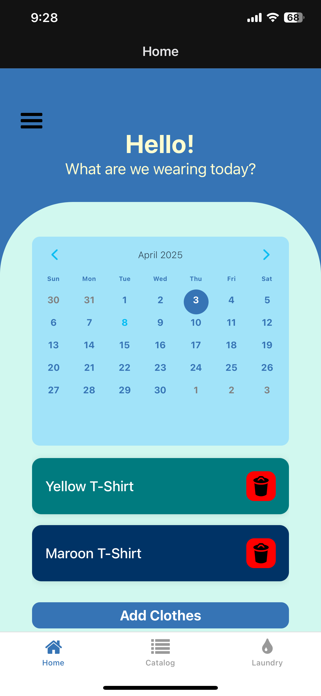
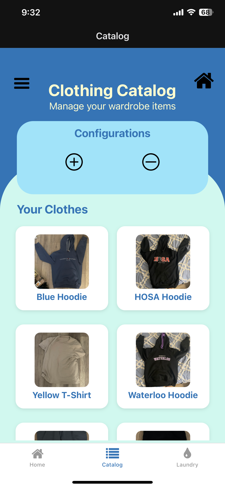
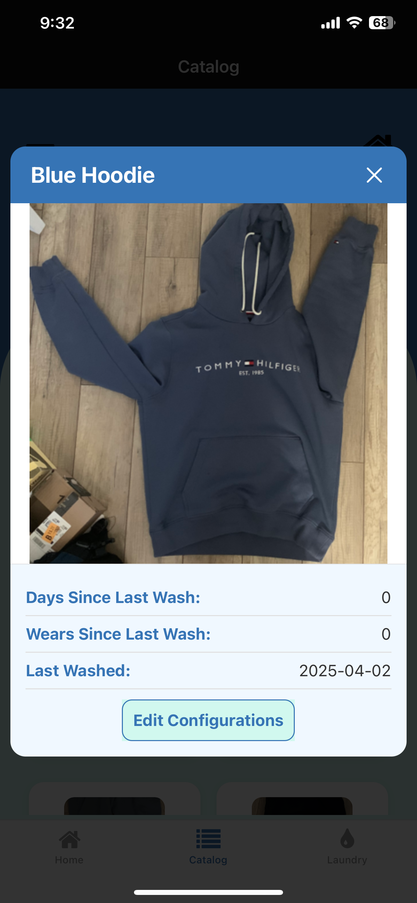
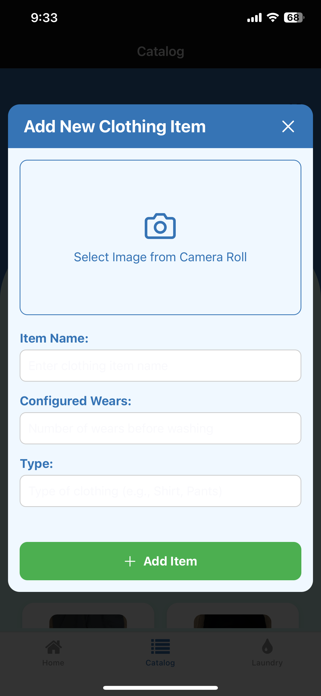
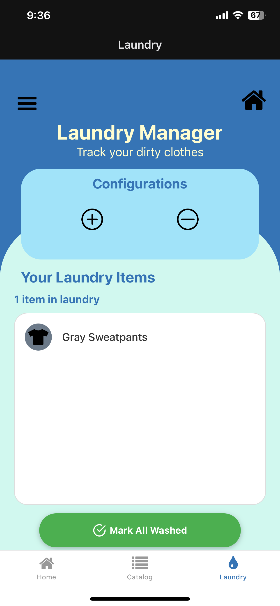

# Track-My-Threads
Do you have trouble remembering what clothes need to be put in the laundry every week? Everyone has some sort of system, whether it is having a separate area to put worn clothes, perhaps designating clothes for certain days or uses, or the smell test (yikes), but it is still not that easy to remember.

TrackMyThreads is an app that I made to help myself keep track of what clothes I need to wash each week. The basic principle is that I log the clothing I wear every day, and the app keeps track of when I wear clothing and it will display a list of clothing I have worn too much without washing.

## How It Works
TrackMyThreads simplifies your laundry management through an intuitive mobile interface built with React Native and Expo. Here's how the app works:
Home Screen
The home screen features a calendar where you can select specific days and log what clothing items you wore. Simply select a date, tap "Add Clothes" and choose from your clothing catalog. This helps track your wear patterns over time and automatically calculates when items need washing.

### Clothing Catalog
The catalog serves as your digital wardrobe inventory. Each item is stored with information about the clothing like name, last washed date, and how many days and wears the clothing has had since you last washed it.

### Laundry Manager
The laundry manager automatically identifies clothing that needs washing based on two criteria:
Number of wears since last wash
Days elapsed since last wash
When an item reaches its configured maximum wears, it automatically appears in your laundry list. You can view all items that need washing in one convenient place and mark them as washed with a single tap of the "Mark All Washed" button.

### Clothing Detection Model 
TrackMyThreads is connected to an object detection model that uses a camera to scan clothes and identify what the user is wearing. The Python script uses a Roboflow YoloV11 model to train itself to find the clothing.

### ESP32 Powered Device
TrackMyThreads can be accompanied with a physical ESP32 device. It uses an ESP32, ESP32-CAM, INMP441 microphone, max98357a audio module, and an IR sensor and remote. The device monitors for when the user wants to scan his clothing, either through the remote or through voice commands. The device then scans by using the camera and outputs it's results in audio.

## Technical Features
- React Native & Expo: Cross-platform mobile app that works on both iOS and Android
- SQLite Database: Local storage for your clothing items and wear history
- Node.js Backend: Express server handling data operations and image storage
- Custom REST API
- Figma Design
- Flask Python backend for running object detection with the app
- Roboflow, YoloV11 model with OpenCV fo detecting clothing
- ESP32 and C++ code for the device firmware
  
 
 
 
 
 

# Demo Video

### [Watch this video on YouTube](https://youtu.be/RkRljqU5kR8)
 
 
 
 
 

  
  
  
  
  

